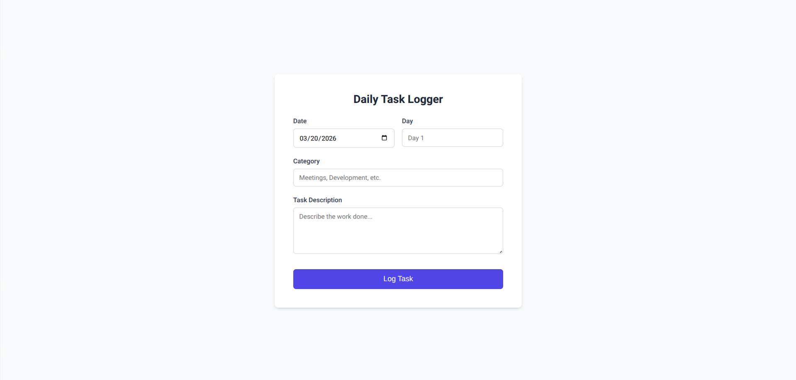
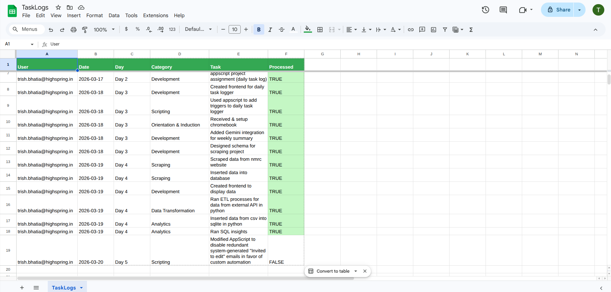

# AI-Powered Task Management & Reporting System

A full-stack automation solution built with **Google Apps Script** and **Gemini 2.5 Flash**. This system streamlines daily task logging, automates document generation, and leverages LLMs to produce professional, first-person weekly executive summaries.

---

## Key Features

* **Responsive Web Portal:** A mobile-friendly custom HTML5/CSS3 frontend for real-time task entry.
* **Daily Automated Digests:** A nightly engine that compiles raw logs into formatted Google Docs and delivers them via **No-Reply** email.
* **AI-Driven Weekly Reports:** Saturday night automation that scopes Monday–Friday tasks and uses the **Gemini 2.5 Flash API** to write analytical, first-person executive summaries.
* **Visual Database Tracking:** A Google Sheets backend with automated status updates and color-coded processing cues (`#c4f7c4`).
* **Security & Scalability:** Uses **Script Properties** for API key vaulting and handles multiple users via unique email identification.

---

## Technical Architecture

* **Frontend:** HTML5, CSS3 (Inter UI), JavaScript (`google.script.run`).
* **Backend:** Google Apps Script (V8 Engine).
* **AI Integration:** Google Gemini 2.5 Flash (REST API).
* **Database:** Google Sheets API.
* **Document Engine:** Google Docs Service.
* **Automation:** Time-driven triggers (Daily/Weekly).

---

## File Structure

| File | Responsibility |
| :--- | :--- |
| `Code.gs` | Core backend logic, Web App routing, and Daily Digest automation. |
| `WeeklySummary.gs` | AI integration logic and Monday-Friday reporting engine. |
| `Index.html` | The user interface and frontend form validation. |

---

## System Preview

| User Interface | Automated Sheet log | AI Weekly Summary |
| :---: | :---: | :---: |
|  |  |  |
